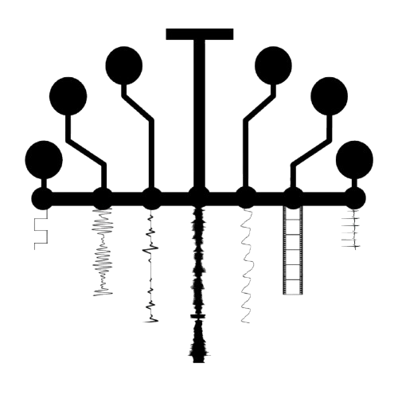
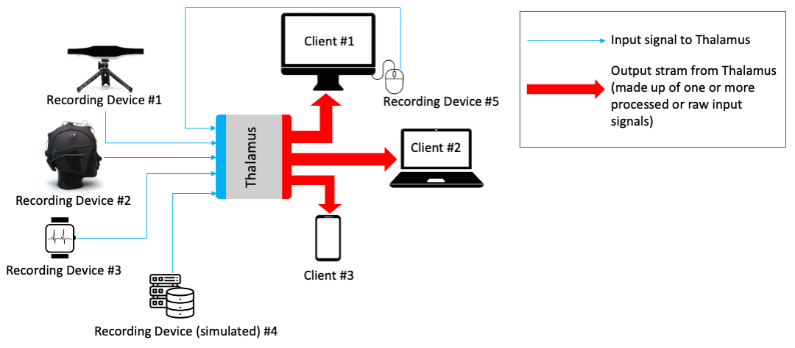
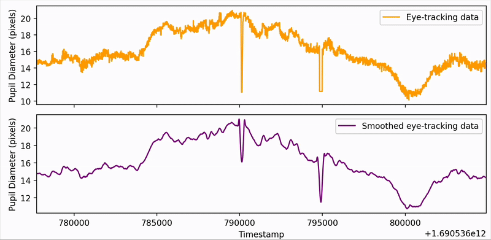
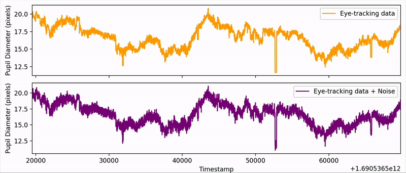
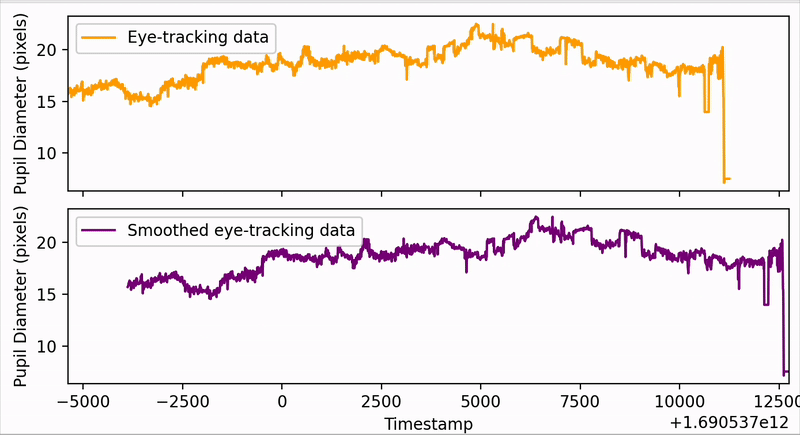

# Thalamus

<p align="center">
  
  <br>
  A Multimodal Sensing and Simulation Toolkit
</p>




### Start Thalamus

```shell
python3 thalamus.py --device-port 9000 --client-port 9001
```

### Connect recording device(s)

To connect a device to Thalamus, you just need to implement the `RecordingDevice` class. The data stream can come from a real device or from pre-recorded data. The example below (also provided as `run_dev_unicorn_hybrid_black_eeg.py`) shows how to simulate a [Unicorn Hybrid Black](https://www.unicorn-bi.com/unicorn-hybrid-black) EEG device and stream its data via Thalamus:

```python
import json
import socket
import time
import random
from device_interface import RecordingDevice
import pandas as pd

class SimulatedDevice(RecordingDevice):
    def __init__(self, device_id, interval=1.0, **kwargs):
        super().__init__(device_id, **kwargs)
        self.interval = interval
        self.df = pd.read_csv('path/to/eeg.csv')
        self.entry_index = 0

    def get_data_entry(self):
        data_entry = self.df.iloc[self.entry_index].to_dict()
        self.entry_index += 1
        return data_entry

    def start(self):
        with socket.socket(socket.AF_INET, socket.SOCK_STREAM) as sock:
            sock.connect((self.server_host, self.server_port))
            print(f"[{self.device_id}] Connected to server at {self.server_host}:{self.server_port}")
            while True:
                entry = self.get_data_entry()
                entry['device_id'] = self.device_id
                msg = json.dumps(entry)
                print(f"[{self.device_id}] Sending: {msg}")
                try:
                    sock.sendall(msg.encode('utf-8') + b'\n')
                except BrokenPipeError:
                    print("Connection to server lost.")
                    break
                time.sleep(self.interval)

if __name__ == '__main__':
    sampling_frequency = 250 # Hz
    interval = (1000/sampling_frequency)/100 # in seconds
    device = SimulatedDevice(device_id='unicorn_hybrid_black_eeg', interval=interval)
    device.start()

```

Then:

```shell
python3 run_dev_unicorn_hybrid_black_eeg.py
```

We provide two additional examples: one for the [GP3 Eye Tracking Device](https://www.gazept.com/product/gazepoint-gp3-eye-tracker) (`run_dev_gp3_eye_tracker.py`) and one for the [Logitech C505e webcam](https://www.logitech.com/de-at/products/webcams/c505e-business-webcam.960-001372.html) (`run_dev_logitech_c505e_webcam.py`).


### Connect client(s)

You can implement one or more instances of a client, as shown in the example below. You can also choose which device(s) will stream to the client:

```python
import socket
import json

def start_client(subscribe_to=['device_01'], server_host='localhost', server_port=9001):
    with socket.socket(socket.AF_INET, socket.SOCK_STREAM) as sock:
        sock.connect((server_host, server_port))
        sub_msg = json.dumps({'subscribe': subscribe_to})
        sock.sendall(sub_msg.encode('utf-8'))
        print("Subscribed to:", subscribe_to)
        try:
            while True:
                data = sock.recv(1024)
                if not data:
                    break
                print("Received:", data.decode('utf-8').strip())
        except KeyboardInterrupt:
            print("\nClient exiting.")

if __name__ == '__main__':
    start_client(['unicorn_hybrid_black_eeg', 'gp3_eye_tracker', 'logitech_c505e_webcam'])

```

Then:

```shell
python3 client.py
```


### Built-in features and functions

### Missing values
In a real-world setting, missing values are a common issue that can occur during data collection. For example, in eye-tracking recordings, if the participant looks outside the screen, there would be no valid value of eye movement to record. To simulate this issue, Thalamus sends a conventional value such as "0" or "NA" as an indicator of missing values 

### Filters
The ability to apply various kinds of filters to the data streams is another feature of our toolkit. The example below show the use of Savitzky-Golay filter on pupil diameter data:

<p align="center">
  
</p>

### Signal synchronization
By ensuring that data from many devices is processed in a uniform and standardized manner (using UTC timestamps), it is simple to compare and evaluate data from various devices and during different time periods. From a technical perspective, all connected or simulated devices should have their system clocks in time and submit their data associated with a Unix timestamp, which is a standardized time reference — the number of (milli)seconds elapsed since January 1, 1970. The example below show the synchronisation of EEG, and eye-tracking data:

<p align="center">
  
</p>

### Noise
The presence of noise in the data streams is another pervasive issue that arises often in real-world circumstances. The example below shows how a Gaussian noise can be add to a live stream signal of pupil diameter:

<p align="center">
  
</p>

### Delay simulation
<p align="center">
  
</p>

