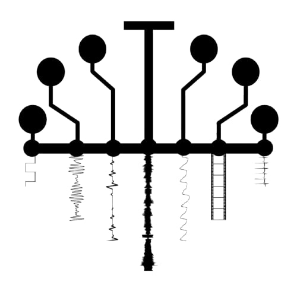
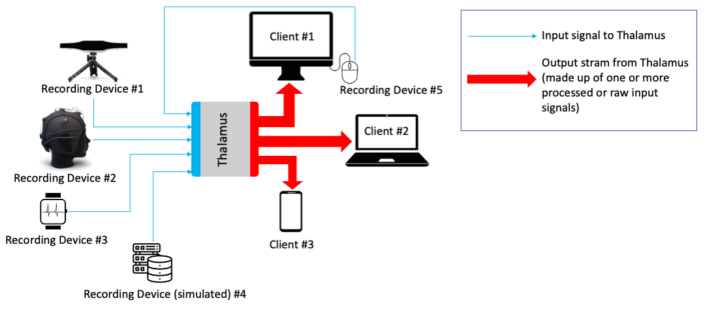
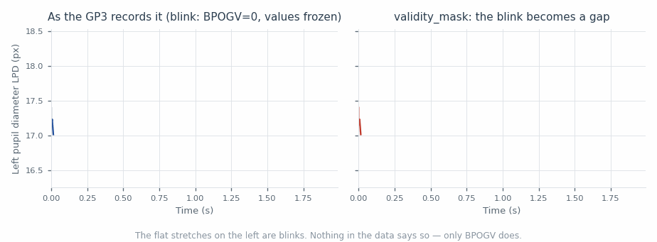
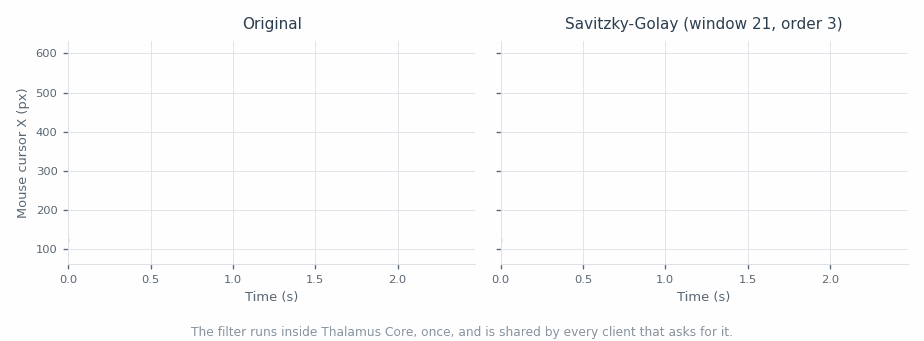
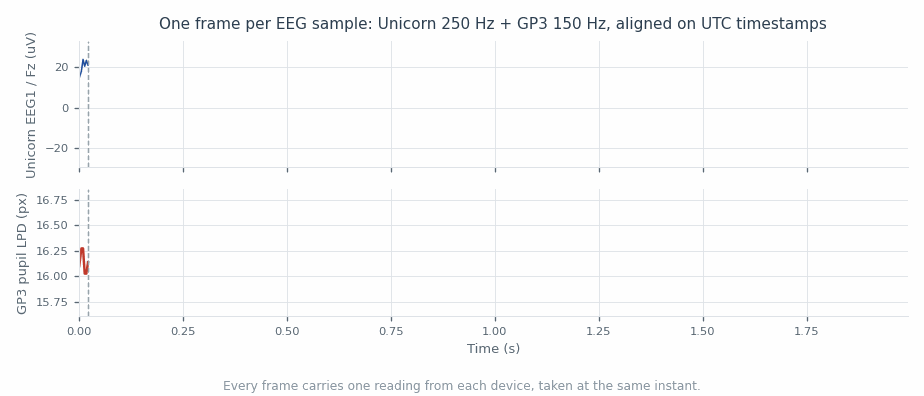
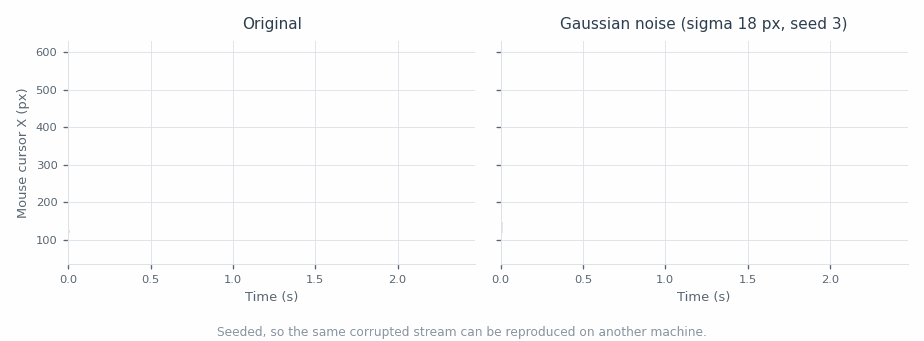
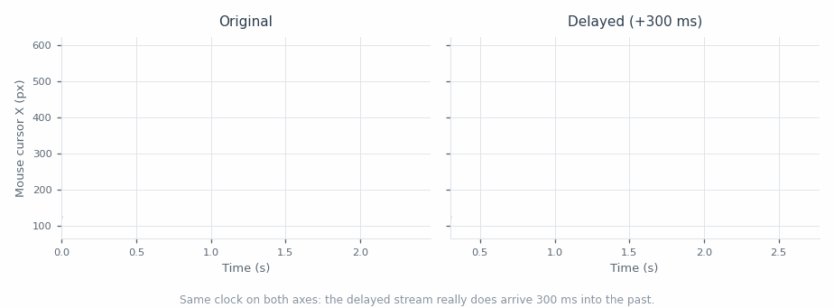

<p align="center">
  
  <br>
  <b>A Multimodal Sensing and Simulation Toolkit</b>
  <br>
  <sub>Prototype a physiological study before you buy the hardware, book the lab, or pay a participant.</sub>
</p>

<p align="center">
  <a href="https://doi.org/10.1145/3708319.3733687"></a>
  
  
</p>

---

Running a study with EEG, eye tracking, and physiological sensors is expensive and
slow, and most of what goes wrong goes wrong in the software. Thalamus lets you find
that out first: it streams real or simulated signals from any number of devices,
synchronizes them on UTC timestamps, and does to them all the things a real study
does — drops packets, loses the pupil mid-blink, adds noise, lags the network — so
that your recording and analysis code meets those problems in a dry run rather than
in front of a participant.

## Sixty seconds

```shell
pip install -e .
thalamus demo
```

That is a complete three-device study: an 8-channel EEG cap at 250 Hz with a drifting
electrode, a 150 Hz eye tracker that blinks, and an ECG on a lossy link. No data
files, no hardware. In another terminal:

```shell
thalamus devices                                    # what's connected, at what real rate
thalamus monitor eye_tracker                        # watch a stream (and its blinks)
thalamus monitor eeg eye_tracker ecg --sync         # all three, aligned on one timeline
thalamus record eeg eye_tracker --out ./rec         # write it to CSV
```

```
DEVICE                       RATE    SAMPLES  CHANNELS
eeg                      247.9 Hz        590  ch_Fp1, ch_Fp2, ch_C3, ch_C4, ch_Pz, ...
ecg                      127.9 Hz        302  lead_ii
eye_tracker              149.9 Hz        354  pupil, gaze_x, gaze_y
```

Note the rate column: that is the rate the device is *actually* achieving, not the one
it claims. If it says `190/250 Hz!`, you have learned something.

## How it fits together



**Thalamus Core** is the hub. Devices connect to one port and stream samples in;
clients connect to another and subscribe to whatever they want. Everything is JSON,
one object per line, over plain TCP — so a client does not have to be Python, or on
the same machine, or even on the same continent.

**Recording devices** are real or simulated. A simulated one replays a CSV recording
or generates signals from nothing; a real one is a ~10-line subclass. Every sample
carries a UTC millisecond timestamp, which is what makes cross-device synchronization
possible at all.

**Clients** subscribe to devices, and may also *send* samples — a client that streams
its classifier's output back into the hub becomes a recording device that other
clients can subscribe to (Recording Device #5 in the figure).

## Describe a study in one file

```yaml
# study.yaml — run it with: thalamus run study.yaml
devices:
  - id: eeg
    type: replay
    path: data/eeg.csv           # no `rate:` — replay honours the file's own timing,
    loop: true                   # jitter and all, which is the honest simulation
    simulate:
      - stage: constant_noise    # an electrode drifting as the gel dries
        offset: 0.5
        drift: 0.0002

  - id: eye_tracker
    type: synthetic              # generated: no recording needed
    rate: 150
    signals:
      pupil:  {kind: sine, freq: 0.2, amplitude: 0.4, offset: 3.5}
      gaze_x: {kind: random_walk, step: 6, start: 960, minimum: 0, maximum: 1920}
    simulate:
      - stage: missing_inject    # blinks: at 150 Hz, 15-60 samples is 100-400 ms
        probability: 0.004
        burst: [15, 60]
        channels: [pupil]        # the pupil is lost; the gaze position is not
        seed: 7                  # a seed makes the whole run reproducible
```

`simulate:` is what is wrong with *this device* — every client sees it, because it is
part of what the device is. What a *client* does with the signal afterwards is a
separate thing, requested per subscription (below).

The config is validated completely before anything starts listening, so a typo fails
in the first second rather than forty minutes into a dry run.

## Built-in features

The Core processes a stream **once** and shares the result with every client that asked
for the same thing, so ten clients plotting a filtered EEG cost one filter, not ten.

Every figure below was generated by [`scripts/make_figures.py`](scripts/make_figures.py),
which starts a real Core, streams a real device through it, and plots what actually came
back off the socket. If a stage breaks, the figures break with it.

### Missing values

<p align="center"></p>

An eye tracker records nothing while the participant looks away or blinks. Thalamus
distinguishes a gap from a real zero all the way through: it arrives as `NA`, travels
as JSON `null`, and is only turned into a number if you ask.

```python
client.subscribe("eye_tracker", pipeline=[{"stage": "missing_fill", "strategy": "zero"}])
```

`zero` (paper Fig. 2), `hold` (carry the last reading forward), `value` (a sentinel you
can detect), or `drop` (discard the sample). Each is a different lie; pick deliberately.

### Filters

<p align="center"></p>

`savgol`, `kalman`, `moving_average`, `exponential`. All causal by default — they use
only the past, because a live stream has no future. Savitzky-Golay also offers a
`centered` mode, which smooths better at the cost of a stated `window // 2` lag.

```python
client.subscribe("eeg", pipeline=[{"stage": "savgol", "window": 11, "polyorder": 3}])
```

### Synchronization

<p align="center"></p>

Ask for several devices aligned onto one timeline and you receive *frames* instead of
samples: one reading per device, taken at (nearly) the same instant.

```python
client.subscribe_synced(["eeg", "eye_tracker"], reference="eeg", tolerance_ms=10)
for frame in client.frames():
    frame["streams"]["eeg"]["ch_Fp1"], frame["streams"]["eye_tracker"]["pupil"]
```

A stream with nothing close enough contributes `None`, not an interpolated guess. A
device that dies does not hold the other streams hostage.

### Noise

<p align="center"></p>

`gaussian_noise`, `uniform_noise`, `constant_noise` (a fixed offset, optionally
drifting). All seedable, because a study whose noise cannot be reproduced is a study
whose results cannot be reproduced.

### Delay and loss

<p align="center"></p>

Three different failures, which break three different things:

| | what it does | what it breaks |
|---|---|---|
| `delay` (`mode: timestamp`) | the sample claims to be older than it is | synchronization logic |
| `delay` (`mode: buffer`) | delivery lags by N samples | real-time logic |
| `dropout` | the sample never arrives at all | anything that counts samples |
| `latency_ms` on a subscription | this one client's link is slow | only that client |

## Writing a device

Implement `samples()`. The socket, reconnection, timestamps, and drift-free pacing are
already written.

```python
from thalamus import RecordingDevice

class MyThermometer(RecordingDevice):
    def samples(self):
        while True:
            yield {"temperature": self.sdk.read()}

MyThermometer("thermometer", rate=10).run()
```

The paper notes the two things that make real devices awkward, and both are handled in
a controller you write once: a device with no UTC clock just omits the timestamp and
gets stamped on arrival; a device that only writes to a file gets tailed. See
[`examples/devices.py`](examples/devices.py).

For simulated devices you usually need no class at all:

```python
from thalamus import ReplayDevice, SyntheticDevice

ReplayDevice("eeg", "eeg.csv", rate=250, loop=True).run()          # from a recording
SyntheticDevice("ecg", {"lead_ii": {"kind": "ecg", "heart_rate": 72}}, rate=128).run()
```

`ReplayDevice` takes `channels=[...]`, which answers the paper's "try before you buy"
question directly: replay a 62-channel SEED recording as if it were a 14-channel
headset, and find out whether 14 would have been enough — without buying either.

## Writing a client

```python
from thalamus import MISSING, ThalamusClient

with ThalamusClient() as client:
    client.subscribe("eye_tracker", channels=["pupil"], pipeline=[
        {"stage": "missing_fill", "strategy": "hold"},
        {"stage": "savgol", "window": 31, "polyorder": 3},
    ])
    for sample in client.stream():
        print(sample.timestamp, sample.data["pupil"])
```

A client can also push samples back in, which makes it a recording device too:

```python
client.send_sample("attention_estimate", {"arousal": 0.7})
client.send_event("stimulus_onset")     # a marker every client sees
```

See [`examples/clients.py`](examples/clients.py) for all four patterns.

## The protocol

You do not need Python. Open a TCP socket, send newline-terminated JSON.

```jsonc
// device -> Core (port 9000). Any key that isn't reserved is a channel.
{"device_id": "eeg", "timestamp": 1690535469479, "Fp1": 12.3, "Fp2": -4.1}

// client -> Core (port 9001)
{"type": "subscribe", "devices": [
    {"device_id": "eeg",
     "channels": ["Fp1"],
     "pipeline": [{"stage": "savgol", "window": 11}],
     "latency_ms": 50}
]}
{"type": "list_devices"}

// Core -> client
{"type": "welcome", "devices": [...], "stages": [...]}   // sent on connect
{"device_id": "eeg", "timestamp": 1690535469479, "Fp1": 12.3}
{"type": "device_disconnected", "device_id": "eeg"}      // a sensor just died
```

A gap is JSON `null`, never `0`. Timestamps are UTC milliseconds.

## Commands

| | |
|---|---|
| `thalamus demo` | a three-device study, no data files needed |
| `thalamus run study.yaml` | your study: the Core plus every device in it |
| `thalamus serve` | just the Core, for devices running elsewhere |
| `thalamus devices` | what is connected, and at what *measured* rate |
| `thalamus monitor <ids>` | print a live stream (`--sync`, `--filter`, `--noise`, ...) |
| `thalamus record <ids>` | write streams to CSV, plus an events file |
| `thalamus stages` | what processing is available |
| `thalamus make-data` | generate sample recordings to replay |

## Installing

```shell
pip install -e .              # the Core, devices, clients, and every dependency-free stage
pip install -e ".[filters]"   # + Savitzky-Golay (SciPy)
pip install -e ".[video]"     # + webcam replay (OpenCV, Pillow)
pip install -e ".[all]"
```

The Core has no scientific dependencies at all — it runs anywhere Python does, and
`kalman`, `moving_average`, `exponential`, and every noise, delay, and missing-value
stage are pure Python. Only Savitzky-Golay needs SciPy, and only video needs OpenCV.

## Coming from the pre-1.0 version?

The wire protocol has not changed, so **existing devices and clients keep working
unmodified** — including clients that send their subscription without a trailing
newline, which the original example did.

What changed:

| before | now |
|---|---|
| `python3 thalamus.py --device-port 9000` | `thalamus serve --device-port 9000` |
| subclass `RecordingDevice`, write the socket loop yourself | subclass it and implement `samples()` |
| `from device_interface import RecordingDevice` | `from thalamus import RecordingDevice` (the old import still works, with a warning) |
| `run_dev_*.py` | [`examples/devices.py`](examples/devices.py), or a line of `study.yaml` |

The features the paper describes — filters, noise, delay, synchronization, missing
values — were not implemented in the original release. They are now, and are covered
by the test suite.

## Development

```shell
pip install -e ".[dev,filters]"
pytest                  # 122 tests, including end-to-end over real sockets
ruff check . && ruff format --check .
```

The test suite covers each layer in isolation and then starts a real Core on real
ports and drives real devices and clients through it, because in a networked toolkit
the bugs live in the seams.

## Citation

```bibtex
@inproceedings{latifzadeh2025thalamus,
  title     = {Thalamus: A User Simulation Toolkit for Prototyping Multimodal Sensing Studies},
  author    = {Latifzadeh, Kayhan and Leiva, Luis A.},
  booktitle = {Adjunct Proceedings of the 33rd ACM Conference on User Modeling,
               Adaptation and Personalization (UMAP Adjunct '25)},
  year      = {2025},
  doi       = {10.1145/3708319.3733687},
}
```

## Acknowledgments

Supported by the Horizon 2020 FET program of the European Union through the ERA-NET
Cofund funding (BANANA, grant CHIST-ERA-20-BCI-001) and Horizon Europe's European
Innovation Council through the Pathfinder program (SYMBIOTIK, grant 101071147).

## License

MIT.
